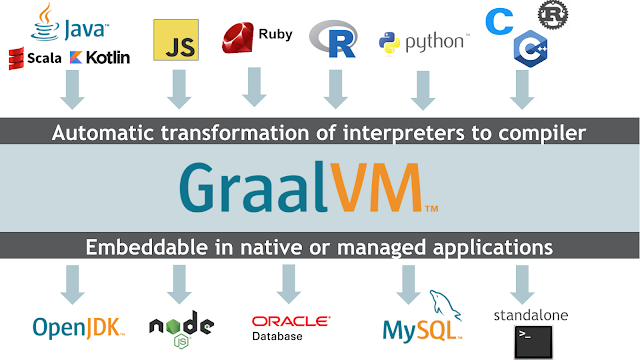
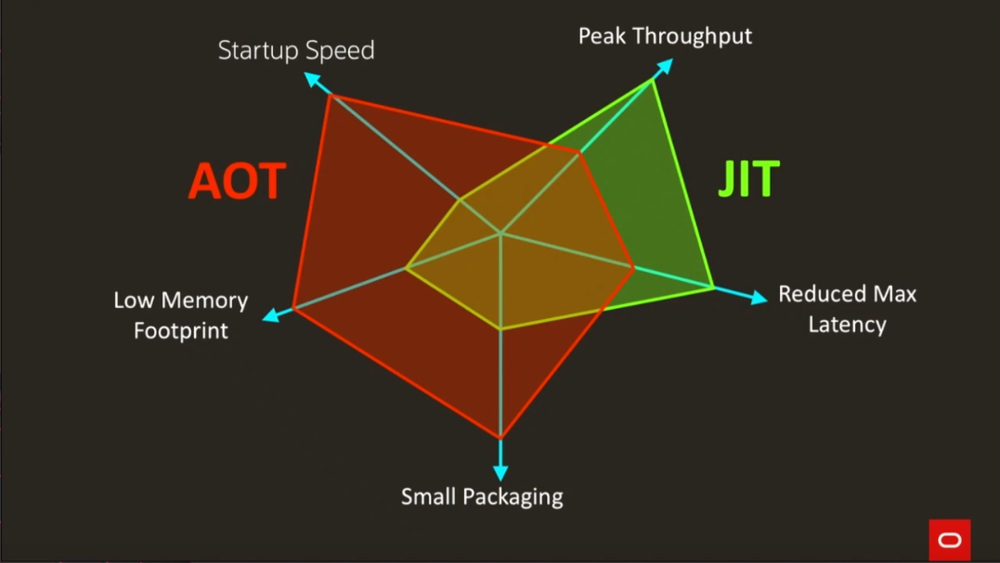
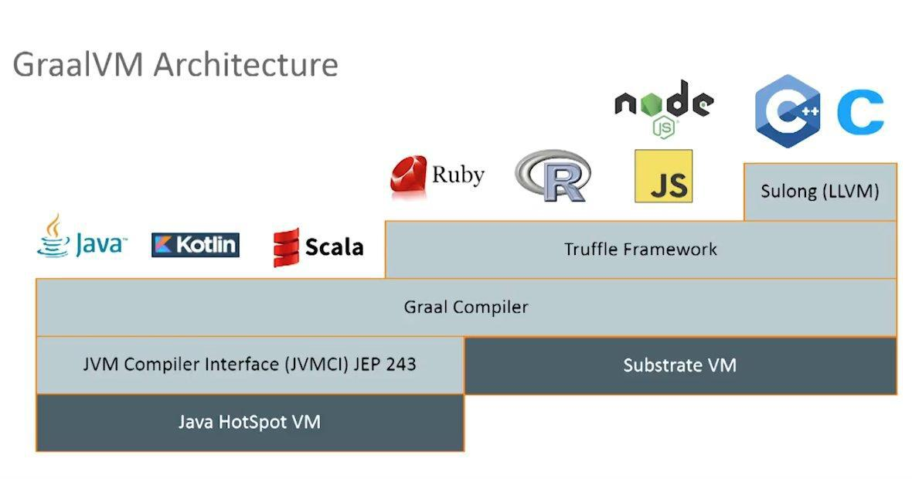

# GraalVM demo

## Modes

* standard JVM
* standalone executable (limited support on Windows)
* Oracle Database, MySQL
  * https://github.com/graalvm/mysql-mle-demos/tree/master/0-demo-hello-js
* node JS (afaik not on Windows)

## Polyglot

* Truffle
* Sulong (LLVM bitcode interpreter)

## Optimizations

* Modification of execution graph
* [Ideal Graph Visualizer](https://www.graalvm.org/docs/reference-manual/tools/#ideal-graph-visualizer)

## Native image

* classes statically initialized by evaluating static code during build time
  * `--initialize-at-build-time`
  * `--initialize-at-run-time`
  * `-H:+TraceClassInitialization`
* limitations
  * reflection
  * class loading
  * resource loading
  * workarounds
    * listing all dynamic accesses in compile time
    * special compile time code
  * configuration options
    * `-H:ReflectionConfigurationFiles=/path/to/reflectconfig`
    * `-H:ConfigurationFileDirectories=/path/to/config-dir/`
    * `-H:ResourceConfigurationFiles=/path/to/resource-config.json`
  * configuration generator (bug in Windows version)
    * `-agentlib:native-image-agent=config-output-dir`
    * `-agentlib:native-image-agent=config-merge-dir`
  * documentation
    * [Native Image Java Limitations](https://github.com/oracle/graal/blob/master/substratevm/LIMITATIONS.md)
    * [Reflection on Substrate VM](https://github.com/oracle/graal/blob/master/substratevm/REFLECTION.md)
    * [Assisted Configuration of Native Image Builds](https://github.com/oracle/graal/blob/master/substratevm/CONFIGURE.md)
    * [Accessing resources in Substrate VM images](https://github.com/oracle/graal/blob/master/substratevm/RESOURCES.md)
* embedding resources
* including libraries
  * Kotlin
  * Helidon
  
---

References:

* [Maximizing Performance with GraalVM](https://www.youtube.com/watch?v=kf5NDRiXfdc)
* [Graal VM and MicroProfile a polyglot microservices solution](https://www.slideshare.net/cesarhernandezgt/2018-codeone-graal-vm-and-microprofile-a-polyglot-microservices-solution-dev6016)
* [Updates on Class Initialization in GraalVM Native Image Generation](https://medium.com/graalvm/updates-on-class-initialization-in-graalvm-native-image-generation-c61faca461f7)
* [Polyglot and Native runtime with GraalVM](http://diego-pacheco.blogspot.com/2019/03/polyglot-and-native-runtime-with-graalvm.html)